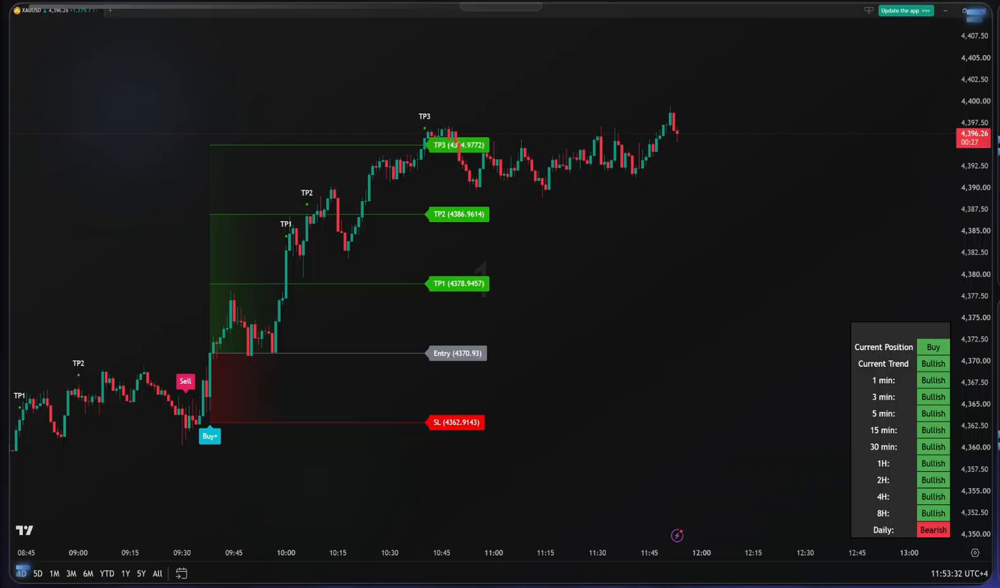

# XAU/USD Signal Tracker

Records every trade the [Daily Trading Tips gold livestream](https://www.youtube.com/watch?v=3H4IVQejlDE)
signals on its 1-minute chart, tracks whether each one reaches its targets or its stop, and keeps a
running professional analysis of the signals.

**How it works.**

1. **Capture, every hour on weekdays.** A GitHub Actions job ([capture.yml](.github/workflows/capture.yml))
   runs [`tracker.run`](tracker/run.py): it grabs a 1080p frame of the stream and reads it with OCR (the live
   trade's entry, stop loss and TP1-TP3, every Buy/Sell/TP marker on the chart, the multi-timeframe trend
   table and the price). The chart keeps about 4 hours of history, so each capture also sees every trade
   since the previous one. The trade log in [`data/`](data) is rebuilt from those markers and this page is
   updated.
   **Weekends:** gold is closed and the same stream switches to **BTC/USDT**. A scheduled task on the
   owner's PC runs the same `tracker.run` every 10 minutes on Saturday and Sunday. Each instrument has
   its own folder (`data/XAUUSD/`, `data/BTCUSDT/`) and its own section below.
2. **Analysis, every 4 hours on weekdays.** A Claude Code cloud routine checks the data against the latest
   chart image, writes entries in the day's file in [`reports/`](reports) and updates the scoreboard and
   verdict in [ANALYSIS.md](ANALYSIS.md).

**YouTube cookies.** YouTube asks GitHub's servers to sign in, so captures use the cookies of a
*throwaway* Google account, stored in the `YT_COOKIES` Actions secret. They expire now and then; after
3 failed captures in a row the workflow opens a `capture-failing` issue (GitHub emails you). To refresh them:

1. Open a private/incognito window and sign in to YouTube with the throwaway account.
2. In that same tab go to `https://www.youtube.com/robots.txt` and export the youtube.com cookies in
   Netscape `cookies.txt` format (for example with the open-source "Get cookies.txt LOCALLY" extension).
3. Close the private window straight away, so YouTube doesn't rotate the exported session.
4. Paste the whole file into **Settings > Secrets and variables > Actions > YT_COOKIES**.

Chart times on the stream are UTC+4; everything here is stored in UTC and shown in IST.
This is a record of someone else's signals for study, not trading advice.

Re-process a saved frame locally: `python -m tracker.main --frame some.png --data-dir /tmp/d`.

<!-- STATUS:XAUUSD:START -->
## 📡 Gold (XAU/USD): live status

Last capture **18 Sep 13:23 IST** (2026-09-18T07:53:31Z) · chart clock 11:53:32

**Gold (XAU/USD): 4396.26** (+1.27% today) · Position **Buy** · Trend **Bullish**

**Active trade:** Buy+ signalled 18 Sep 11:07 IST

| Side | Entry | SL | TP1 | TP2 | TP3 | Risk |
|---|---|---|---|---|---|---|
| Buy | 4370.93 | 4362.9143 | 4378.9457 ✅ | 4386.9614 ✅ | 4394.9771 ✅ | 8.0157 |

**Trend table:** 1m 🟢 · 3m 🟢 · 5m 🟢 · 15m 🟢 · 30m 🟢 · 1H 🟢 · 2H 🟢 · 4H 🟢 · 8H 🟢 · D 🔴

⚠️ Notes on this capture: TP3 label hidden; derived from entry and SL

### 📒 Gold (XAU/USD) trade log (latest 15)

| # | Signal | Signalled | Entry | SL | Targets hit | Result | R |
|---|---|---|---|---|---|---|---|
| 5 | Buy+ | 18 Sep 11:07 IST | 4370.93 | 4362.9143 | TP1 TP2 TP3 | TP3 so far |  |
| 4 | Sell | 18 Sep 11:00 IST | ~4367.53 |  | - | No TP | -1 |
| 3 | Buy+ | 18 Sep 09:59 IST | ~4353.07 |  | TP1 TP2 | TP2 | 2 |
| 2 | Sell | 18 Sep 09:46 IST | ~4359.65 |  | - | No TP | -1 |
| 1 | Buy | 18 Sep 09:02 IST | ~4340.14 |  | TP1 TP2 | TP2 | 2 |

**Scoreboard (4 closed trades):** reached TP1 2/4 (50%) · TP2 2/4 · TP3 0/4 · no target 2/4 · net +2R *(exit at the best TP reached; a trade with no TP counted as -1R)*

Entries marked ~ are estimated from the chart; exact levels are only shown for the live trade.

Full analysis: [ANALYSIS.md](ANALYSIS.md) · data: [trades.csv](data/XAUUSD/trades.csv), [events.csv](data/XAUUSD/events.csv), [levels.csv](data/XAUUSD/levels.csv)

<!-- STATUS:XAUUSD:END -->
